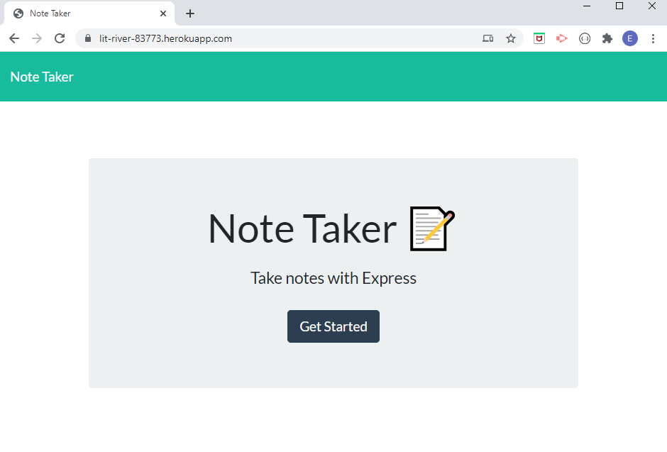
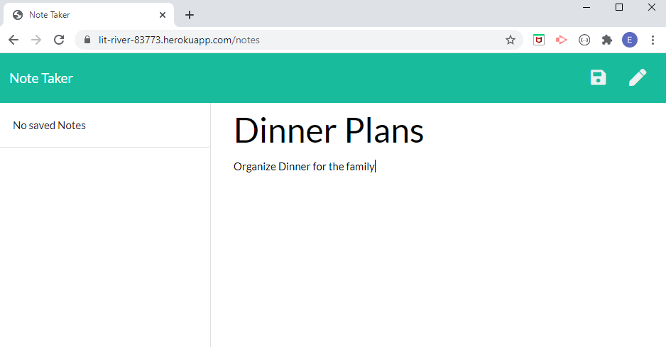
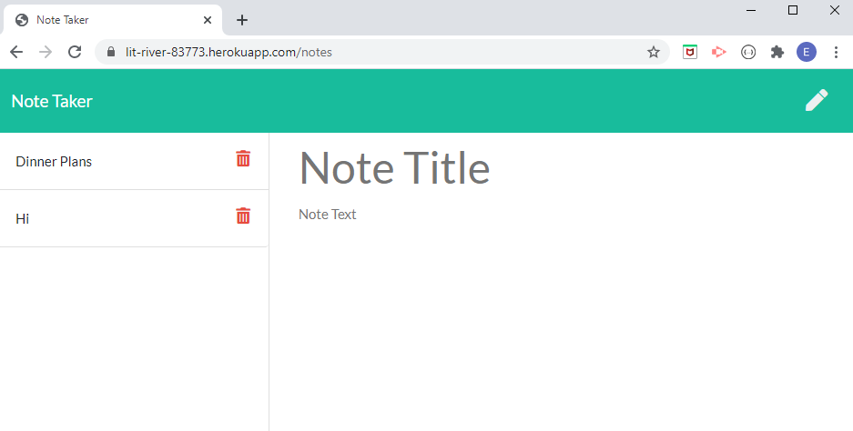

# NOTE_FORGETTABLE 
  

  ## Description ✏️
  
  Note taking application that allows you to save and delete notes with a title and text
  
  ## Table of Contents 📚
  
  * [Installation](#installation)
  * [Usage](#usage)
  * [License](#license)
  * [Contributing](#Contributing)
  * [Testing](#Testing)
  * [Questions](#Questions)
  
  ## Installation 

  📥 
  [Click Here](https://lit-river-83773.herokuapp.com/) to access and use the app through Heroku. 
  



  ## Usage 

  ```
  ▶️ 
  Click on the link to the deployed heroku app in the installation section or use link https://lit-river-83773.herokuapp.com/.
  Enter Title and Text into the text areas and press the 'Save' button.  The note will be added to the list.  
  You can choose to delete the note or view it on the main display where you would put a new note.  
  If you have viewed a not and want to create another one, simply click on the 'pencil' icon on the top right and the text areas will be cleared aloowing the input of another note.
  ```




  ## License 
  
  📜 License Code: GPL-2.0

  For detailed information on license [Click Here](https://opensource.org/licenses/GPL-2.0)
  
  ## Contributing
  
  👌 
  Not currently allowing contributions from others
  
  ## Testing 

  ```
  ✔️ 
  Ensure once the note areas have been populated and the save button clicked, the note should appear in the list on the left-hand side
  ```

  ## Questions 
  
  Direct questions to me via email 📧 at [tmoschos@bigpond.com](tmoschos@bigpond.com).  Please use "NOTE_FORGETTABLE questions" in the subject and I will hopefully return a response within 48hrs.

  More information can be found at my [GitHub Profile](https://github.com/EMoschos).
  
---
This README was created by the "Great-Read" 📝 Node.js app.  Developed by Eleftherios Moschos
